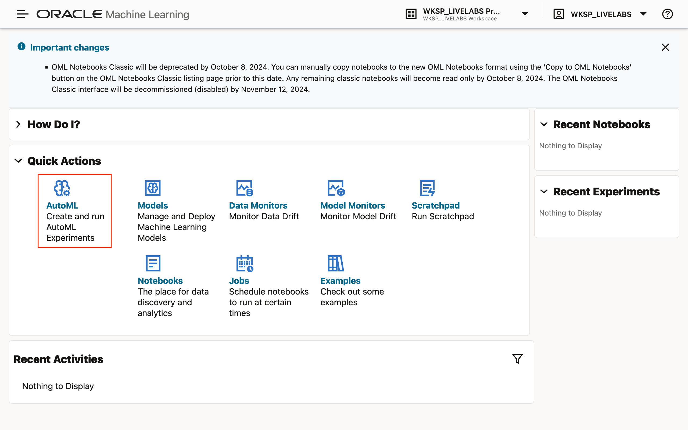
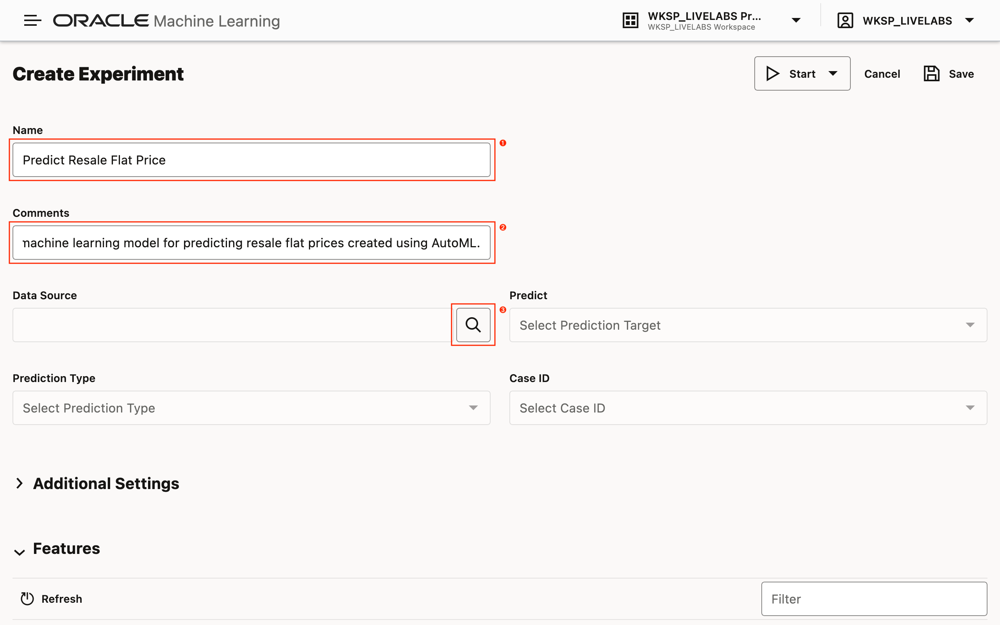
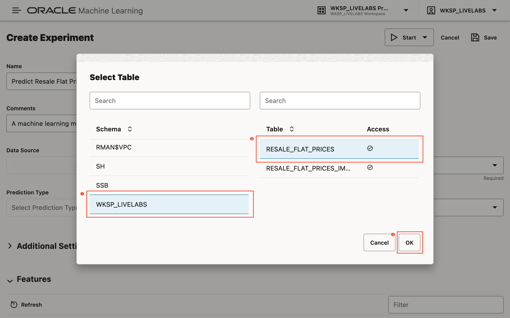
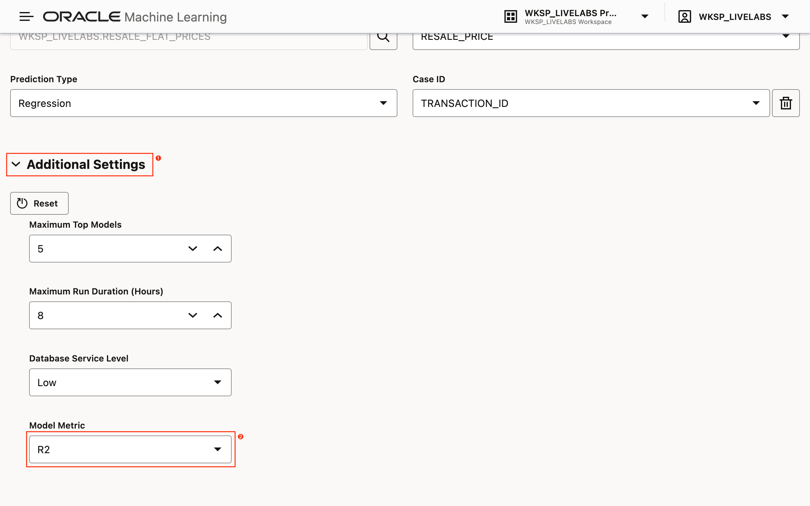
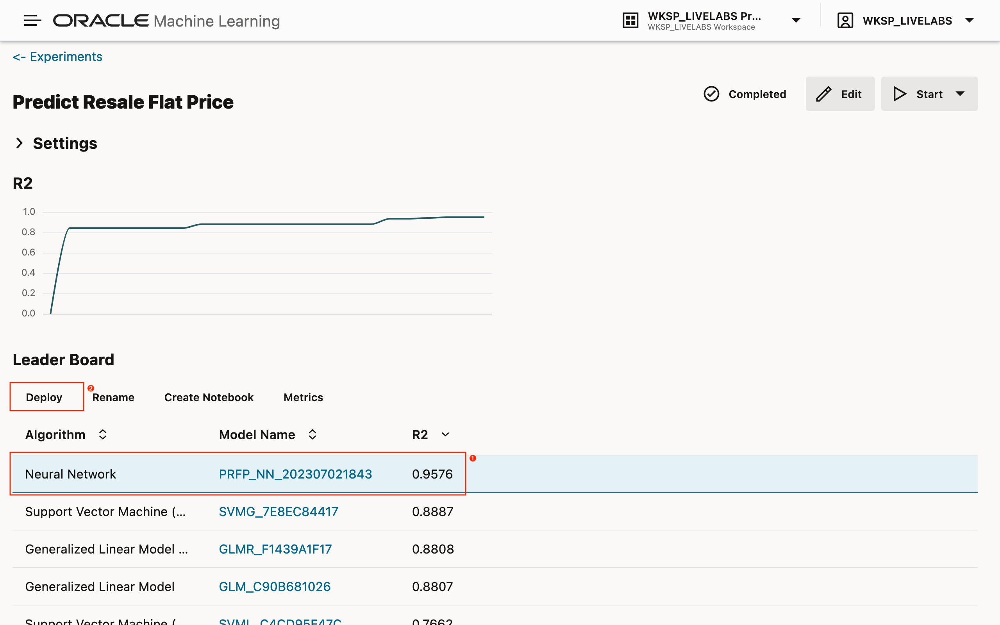

# Train and Deploy a Machine Learning Model with AutoML

In this lab, we will train a machine learning model to using the open data set we had downloaded and prepared in Lab 2, to predict resale flat prices, without the need for any code.

## Introduction

In this lab, we will create an AutoML experiment that will train a machine learning (ML) model for predicting the resale flat prices using data set prepared in Lab 2.

Estimated Time: 30 minutes

### Oracle Machine Learning AutoML User Interface

The AutoML user interface within the Oracle Autonomous Database simplifies the process of developing machine learning models. It offers a visual interface that guides users through the end-to-end process of data preprocessing, feature selection, model training, and model evaluation. With AutoML, users without extensive knowledge of machine learning can still leverage the power of AI to gain insights from their data. The user interface automates the selection of the best algorithms and hyperparameters based on the data characteristics, making it easier for users to create accurate and effective machine learning models.

### Objectives

In this lab, you will learn how to:

* Create an AutoML experiment.
* Train and deploy a ML model.

### Prerequisites

This lab assumes that you have:

* Access to an Oracle Cloud tenancy.
* The necessary privileges to create the resources in this lab.
* Access to the OML user interface as the parsing schema that will be used for the Oracle APEX application.
* In the same schema, loaded and prepared the data set as instructed in Lab 2.

## Task 1: Create an AutoML Experiment

1. In Lab 1, Task 1, you were introduced to the ADB's tools page. Return to the tools page, and then scroll down till you find the section *Oracle Machine Learning user interface* (OML UI). Click the button *Copy* to copy the URL to tool.

1. Login to the OML UI as the schema user, e.g., *`WKSP_LIVELABS`*.

1. Click on the icon *AutoML*, under the section *Quick Actions*, to go to the AutoML Experiments page.

1. Click the button *+ Create* to create a new AutoML experiment.

1. For the new AutoML experiment, first enter the following details:
    * **Name** - Predict Resale Flat Price
    * **Description** - A machine learning model for predicting resale flat prices created using AutoML.

    Then, search for the data source to use to train the ML model. Click the search button next to the textfield for *Data Source*, indicated by a magnifying glass icon.

1. Select the database table containing the data set prepared in the previous lab. Select the schema, and then the table *`RESALE_FLAT_PRICES`*. When finished, click the button *OK* to proceed to the next step.

1. Set the experiment's prediction target (field name *Predict*). The *Prediction Type* should be automatically set to *Regression* as the *`RESALE_PRICE`* column is numeric and has a continuous distribution. Finally, set the *Case ID* to the column *`TRANSACTION_ID`*.

1. Customize the model metric (training goal). First, expand the section *Additional Settings*, then for the field *Model Metric*, choose *R2*.

## Task 2: Run the AutoML Experiment

1. To begin training, click the button *Start*, and then *Faster Results*. Choosing this run mode will yield faster results, but very likely, poorer performing ML model.

## Task 3: Deploy the Selected Machine Learning Model

When time permits, please consider trying other parameter tweaks, and running the experiment with a goal for better accuracy. For now, take a brief look at some of the metrics generated by AutoML, such as the leader board and the table displaying the list of features and their relative importance for determining the predicted values.

In this final task, we will deploy the top performing ML model.

1. From the *Leader Board*, select the top performing ML model, which in the example below, is an *Artificial Neural Network* (ANN) that yields an *R2* value of `0.9576`. R2 values close to `1` are ideal. Then, click the button *Deploy*.

1. In the modal, rename the model if so desired. Otherwise, enter the mandatory values for *URI* and *Version*. The URI is added to the model's request path when the model is deployed. Optionally, enter a value for the model's *Namespace*, and indicate if the model should be shared with every user that has access to the schema. Click the button *OK* to deploy the model.

You may now **proceed to the next lab**.

## Acknowledgements

* **Author** - Adrian Png, Senior Cloud Solutions Architect, Insum Solutions Inc.
* **Last Updated By/Date** - Adrian Png, June 2023
